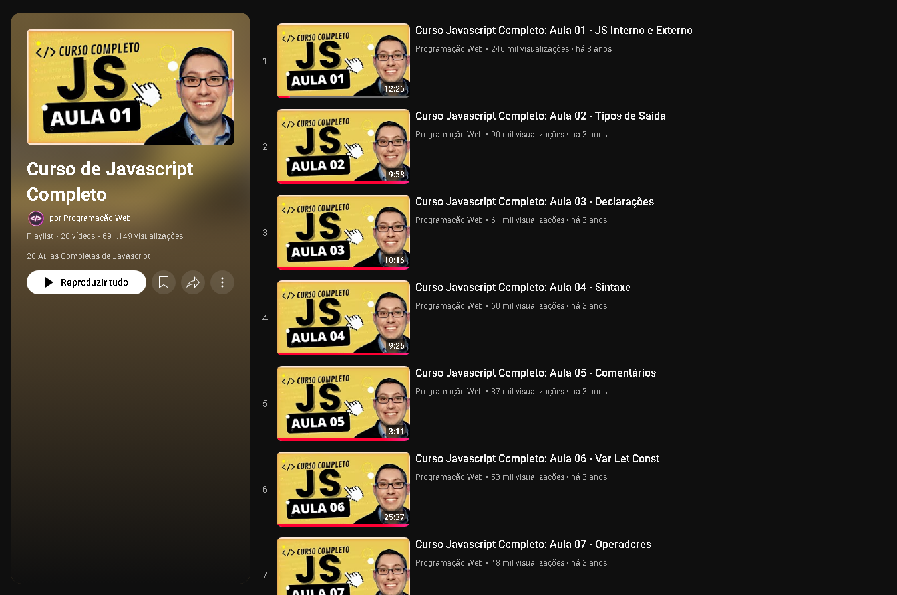
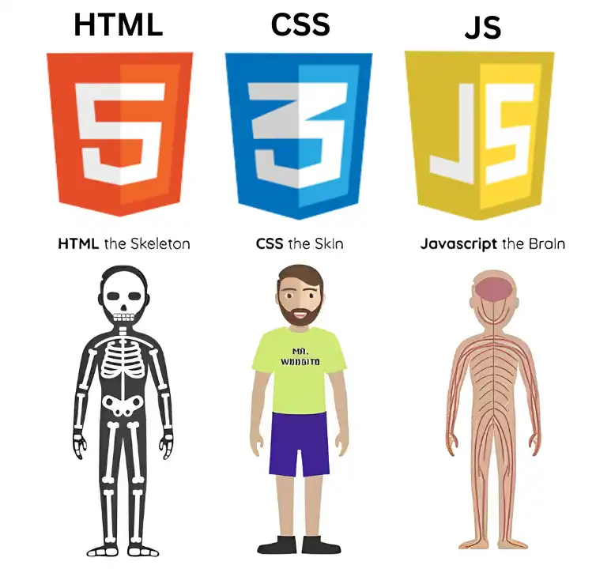

# 📘 Curso JavaScript - Programação Web 

Este repositório foi criado para armazenar e organizar os conteúdos que aprendi durante o **curso de JavaScript**.  
Cada pasta representa uma aula com exemplos práticos, anotações e exercícios que ajudam a fixar os principais conceitos da linguagem.  

---

##  Referência de estudo

Durante meus estudos, utilizei a seguinte playlist do YouTube como base:

- [Curso JavaScript ](https://www.youtube.com/playlist?list=PL2Fdisxwzt_d590u3uad46W-kHA0PTjjw)

  

## 🔹 Conteúdo das Aulas  

- **aula01** – Primeiro commit / Introdução  
- **aula02** – Escrever na tela  
- **aula03** – Declarações  
- **aula04** – Sintaxe da Linguagem  
- **aula05** – Comentários  
- **aula06** – `var`, `let` e `const`  
- **aula07** – Operadores  
- **aula08** – Funções  
- **aula09** – Objetos  
- **aula10** – Eventos  
- **aula11** – Arrays  
- **aula12** – Métodos para Array  
- **aula13** – Estrutura condicional `if` e `else`  
- **aula14** – Estrutura condicional `switch`  
- **aula15** – Estrutura de repetição `for`  

## 🎯 Objetivo  

- 📚 Consolidar fundamentos do JavaScript.   
- 📝 Registrar a evolução no aprendizado.   

---

## 🚀 Próximos Tópicos de Estudo  

- Laços de repetição avançados (`while`, `do while`)  
- Funções de ordem superior  
- Manipulação do DOM  
- Programação assíncrona (`setTimeout`, `Promise`, `async/await`)  
- ES6+ (arrow functions, destructuring, modules)  

 

---
